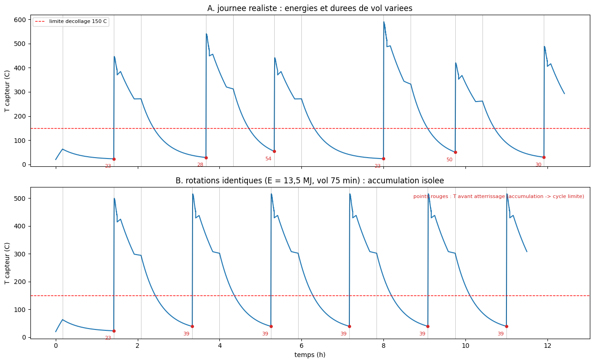
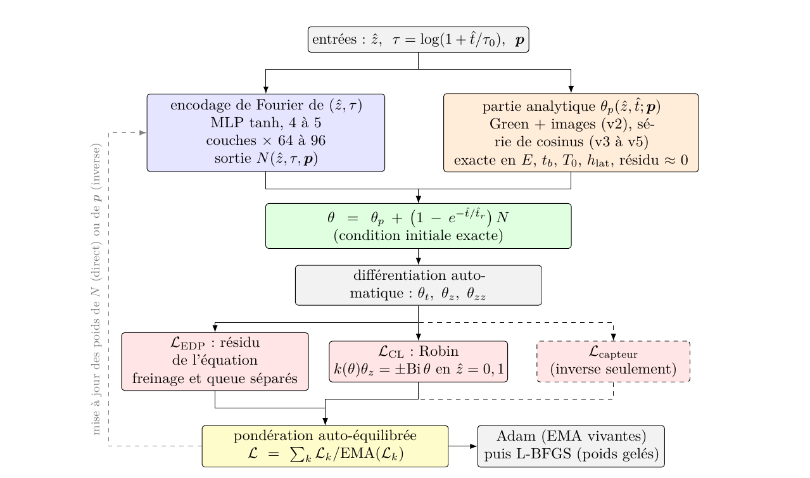
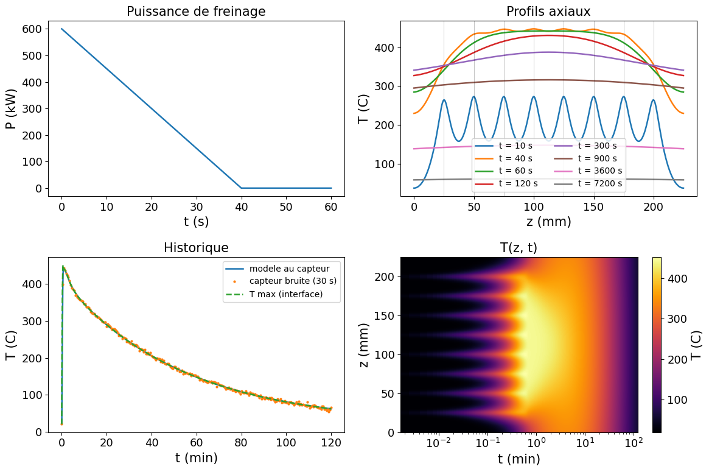
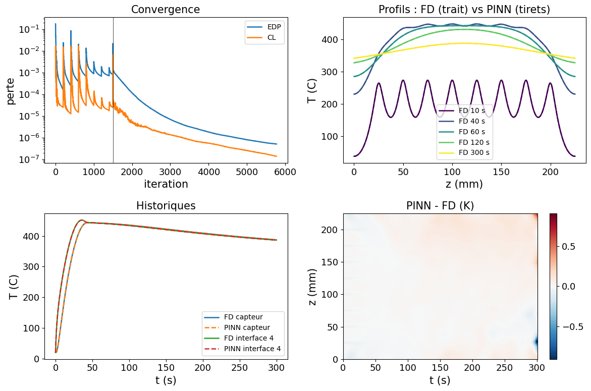
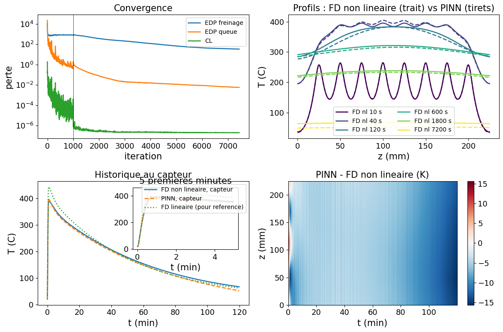
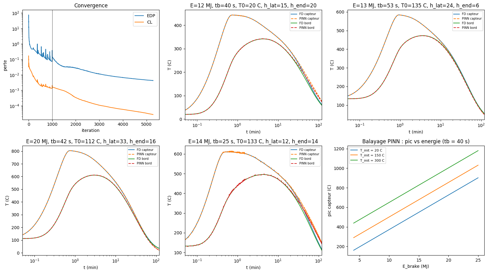
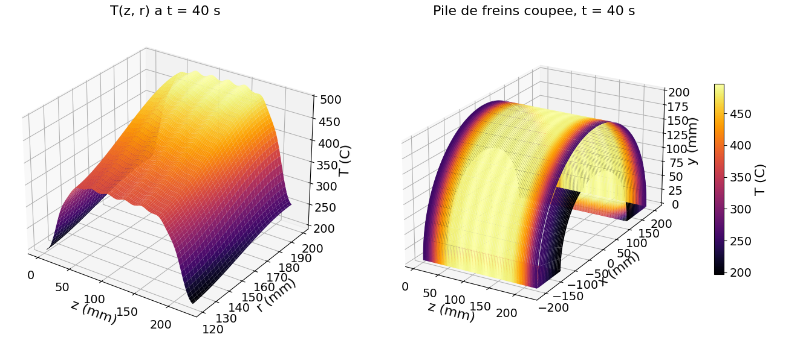
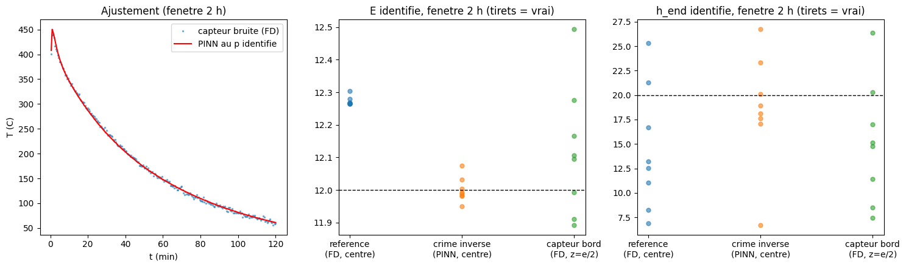

# PINNs for aircraft brake stack thermal modelling

What can a physics-informed neural network really bring to the thermal modelling of an A320 brake stack, and where are its limits? This personal research project builds the answer end to end, from the direct to the inverse problem, on fully synthetic data. Every failure along the way is documented in the [report](report/rapport_pinn_freins.pdf) (French).



## Highlights

- **Direct PINN within 2 K** of the finite-difference reference over the braking window, with a PDE residual around 1e-6.
- The **nonlinear version (k(T), cp(T)) captures a 49 K peak reduction** that the linear model structurally misses.
- A **single parametric PINN** (inputs: z, t + 5 physical parameters) bounded to **15 K over 2 h** on unseen scenarios, then chained to simulate a **full day of rotations**: thermal accumulation converges to a limit cycle in 3 to 4 rotations.
- **Inverse problem**: braking energy identified **within 2% from 5 minutes** of noisy sensor data, with an identifiability study. The convective split (h_lat vs h_end) is diagnosed as structurally unidentifiable from a central sensor: only the global cooling rate is recoverable, within about 5%.

## Method in one paragraph

The ground truth comes from a finite-volume solver (1D axial, 9 carbon discs, Gaussian friction sources at the 8 interfaces, Crank-Nicolson), validated against a 2D axisymmetric solver. The PINN uses an analytic ansatz (Green's function with image sources, then an exact cosine series) so that the network only learns what resists analysis: end convection, nonlinear physics, unknown parameters. Losses are computed by automatic differentiation and self-balanced with moving averages; training runs Adam then L-BFGS.



## Repository layout

| File | Role |
|---|---|
| `brake_stack_fd.py` | 1D finite-volume reference solver, exports the synthetic dataset |
| `brake_stack_fd_2d.py` | 2D axisymmetric validation solver |
| `brake_stack_pinn_v2.py` | Direct PINN, Green's function ansatz, 0 to 300 s |
| `brake_stack_pinn_v3.py` | Long window (2 h), exact cosine series, log-time input |
| `brake_stack_pinn_v4_nonlin.py` | Nonlinear k(T), cp(T), self-balanced losses |
| `brake_stack_pinn_param_colab.py` | Parametric PINN over 5 physical parameters |
| `brake_stack_day.py` | Full day of rotations by chaining the parametric model |
| `brake_stack_inverse.py` | Inverse problem and identifiability study |
| `report/rapport_pinn_freins.pdf` | Full write-up (French) |

## Run it

```bash
pip install -r requirements.txt
python brake_stack_fd.py          # generate the synthetic dataset
python brake_stack_pinn_v2.py     # train the direct PINN
```

Training was done on Google Colab (T4 GPU); everything also runs on CPU, just slower.

## Context

Conducted alongside my Master's thesis with Airbus and Cranfield University on A320 brake temperature estimation (real flight data, hence not publishable). This repository is the fully open counterpart: same physics, synthetic ground truth. More on my [portfolio](https://ugo-roccamatisi.github.io).

## Gallery

| | |
|---|---|
|  |  |
|  |  |
|  |  |
